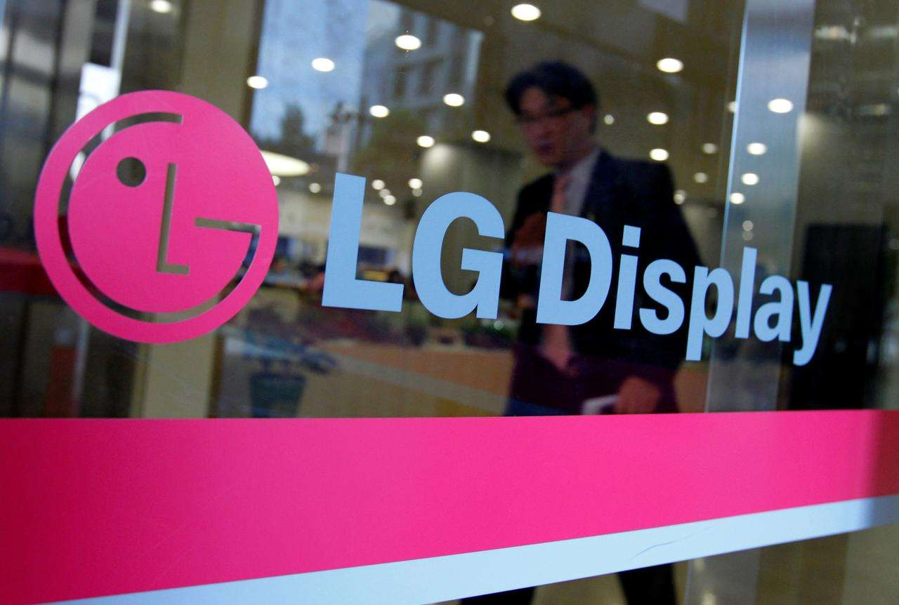

据THE ELEC报道，LG Display的一位高管表示，该公司认为硅上OLED（OLEDoS）将成为未来元宇宙的设备中使用的主要显示屏。

LG Display副总裁Yang Joon-young周五在首尔举行的TheElec Metaverse会议上说，近年来围绕OLED的技术得到了改进，这导致行业在涉及微显示器时从硅上液晶（LCoS）转向OLEDoS。微型显示器是指尺寸在1英寸左右的显示器，用于增强和虚拟现实设备。这些显示器使用硅作为基材，而不是玻璃，这使它们能够在屏幕尺寸较小的情况下达到超高清显示。

据报道，元宇宙设备的兴起，也拉升了对传感器、面板等零部件的需求。在元宇宙产品的面板方面，LG显示副总裁Yang Joon-young近日表示未来主要会是硅基OLED面板。Yang解释说，下一代VR设备将使用每英寸3000像素或更高分辨率的OLEDoS，以及超过5000尼特的亮度。对于AR，OLEDoS的优势是使外形尺寸小，使其成为设备的最佳显示器，这位LG Display高管说，现有的LCoS可用于低端AR设备。