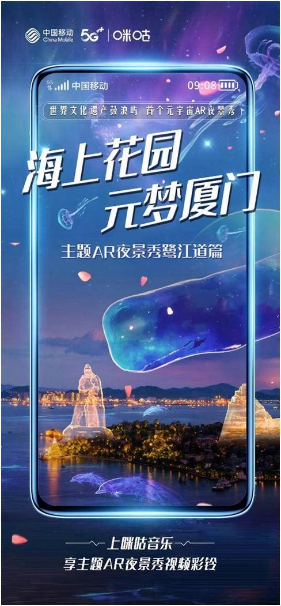
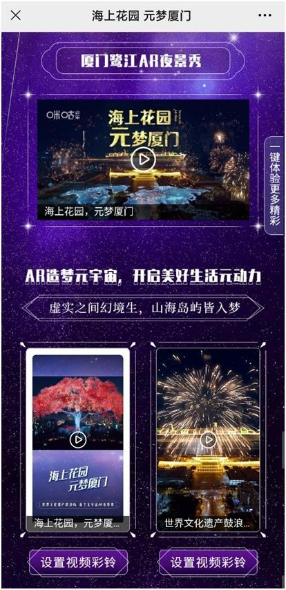
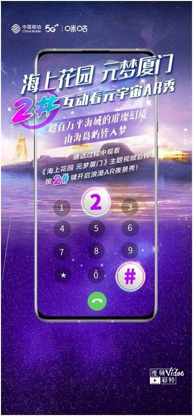

近日，以“全球发展：共享数字机遇投资绿色未来”为主题的第二十二届中国国际投资贸易洽谈会(简称“投洽会”)在厦门举办。紧扣数字经济发展趋势，投洽会首次聚焦元宇宙，依托中国移动咪咕公司5G+T.621+AR技术能力创新打造的福建首个跨百万平海域元宇宙AR秀点亮鹭岛，向国际递出了新的厦门数智名片，并依托中国移动视频彩铃全球首创的2#“短带长”互动玩法，为元宇宙城市宣传注入新动力。

以投洽会元宇宙系列活动为基础，中国移动视频彩铃特别上线了“海上花园·元梦厦门”专区，来电期间就可接通元宇宙AR夜景秀，体验厦门元宇宙式浪漫：巨大的黄金月亮当空而立、鼓浪屿幻化而出，海豚穿梭于楼宇之间，成群白鹭展翅起舞、绚烂的烟花照亮夜空……虚实交融，为用户带来跨时空沉浸体验。

用户除了可以将其设置为自己的视频彩铃，福建省移动用户还可以在打电话时参与2#互动，观看和订购更多精彩内容，身临其境感受厦门的山、岛、湖、海。凭借内容、技术、玩法等多重生态优势，中国移动视频彩铃以2#互动玩法赋能城市宣传，通话过程中观看主题视频彩铃，按2#键互动引流观看长视频内容新体验，反哺长视频及更多内容助力城市品牌打造，让更多人领略厦门之美。

目前，中国移动视频彩铃用户规模已超过3亿，月播放量超过170亿次，已成为最重要的融媒体宣发平台之一。自2021年中国移动5G+视频彩铃数智融媒(福建)平台正式发布以来，与金鸡百花奖、鼓浪屿元宇宙等扎根于厦门的IP开展了多元、深度的合作。以内容+科技+融合创新，中国移动视频彩铃在城市宣传、影视宣发、品牌推广、公益宣传、政务党建、乡村振兴等领域正持续发力，中国移动咪咕将借助5G+视频彩铃产业联盟、5G+视频彩铃数智融媒平台，携手更多行业伙伴，在视频彩铃内容、标准、技术、产品、平台等方面持续创新，实现全产业价值共创、商业共生，助力数智融媒发展。