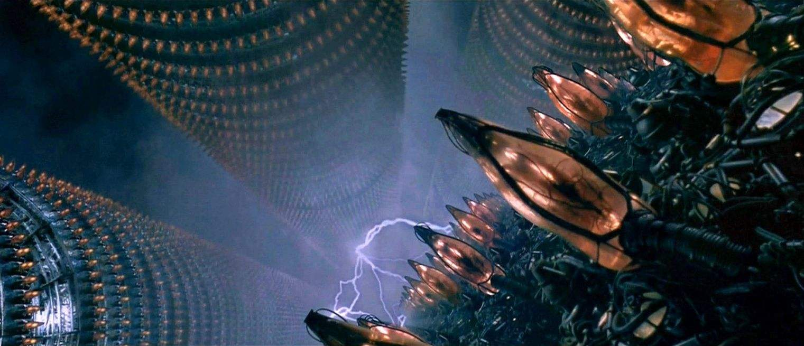

森山大道与IOMA爱马思艺术中心推出元宇宙联名系列又有新动作。

在IOMA爱马思艺术中心最新发布的3天倒计时悬念海报上，此前“Lips Lips Lips RED”字样已替换成“Honnverse”，不少网友猜测，该信息是否预示着IOMA爱马思与森山大道推出的“艺术周边与数藏联名”系列将和“Honnverse虹宇宙”有关。

据悉，“Honnverse虹宇宙”是国内率先落地元宇宙社交产品，集“区块链+身份体系+沉浸互动+兴趣社交+品牌商业”等功能于一体。在虹宇宙，每一个用户都拥有自己的身份与虚拟形象，通过道具、互动、社交，不断拓展和完善自己在虹宇宙世界里的空间和生活关系。虹宇宙此前与钟华、邱德光等知名艺术家，锦绣中华、敦煌IP、国家图书馆等众多文博IP合作发布数字藏品，助力传统文化数字化焕新；并帮助拉菲红酒、龙湖地产合作、爱慕等品牌发布专属“数字藏品”及打造元宇宙品牌空间，赋能品牌面向Web3.0时代的元宇宙营销。

若此次世界知名街拍大师、国际著名先锋摄影艺术家森山大道于虹宇宙发行数字藏品，则将是虹宇宙合作的首位国际顶级摄影师，也将成为森山大道联名的首个数字藏品。而基于虹宇宙的社交属性与元宇宙虚拟生活社区定位，或将为此次联名款带来别样玩法。